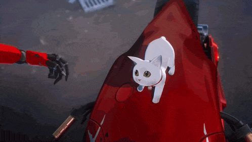

<!-- HEADER & TYPING BANNER -->

  

 

<!-- MAIN SHOWCASE GIF -->

  

    
  

---

<!-- ABOUT ME & CONNECT (TABLE LAYOUT) -->
<table width="100%" style="border-collapse: collapse; border: none;">
  <tr>
    <td width="60%" valign="top" style="border: none;">
      <h3>🗡️ About Me</h3>
      

        Hi! I'm <b>zyoozhanghao</b>. Passionate about <b>Frontend Web Development</b> and building sleek, responsive web applications.
      

      

        When I'm not debugging or tweaking UI designs, you can find me grinding games like <b>Punishing: Gray Raven</b> (Alpha Main ⚡), playing <b>Geometry Dash</b>, or reading manga & manhwa.
      

      <ul>
        <li>🔭 <b>Currently working on:</b> Interactive web projects & UI experiments</li>
        <li>🌱 <b>Currently learning:</b> Modern Frontend Ecosystem & State Management</li>
        <li>💬 <b>Ask me about:</b> Vue, Laravel, Tailwind CSS, or PGR lore!</li>
      </ul>
    </td>
    <td width="40%" valign="top" align="center" style="border: none;">
      <h3>🎯 Connect & Socials</h3>
        
        
        
      
    </td>
  </tr>
</table>

---

<!-- TECH STACK & ARSENAL -->

  <h3>🛠️ Tech Stack & Arsenal</h3>
   
  

---

<!-- PACMAN CONTRIBUTION ANIMATION -->

  <h3><code>zyoozhanghao@github ~ $ ./contributions.sh</code></h3>
  <picture>
    <source media="(prefers-color-scheme: dark)" srcset="https://raw.githubusercontent.com/zyoozhanghao/zyoozhanghao/output/pacman-dark.svg">
    <source media="(prefers-color-scheme: light)" srcset="https://raw.githubusercontent.com/zyoozhanghao/zyoozhanghao/output/pacman-light.svg">
    
  </picture>

 

<!-- GITHUB STATS & LANGUAGES (DARK/CRIMSON THEME) -->

  
  

 

<!-- GITHUB STREAK -->

  

